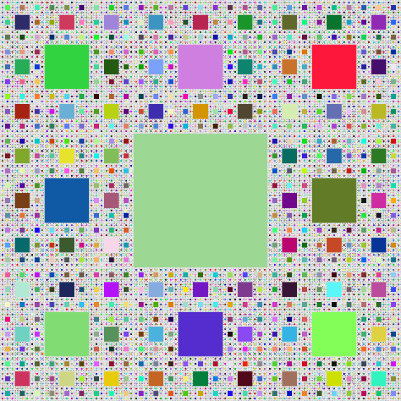

# 👋 Hi, I’m Thomas Wening!  
I’m a **Software Developer** with a background in **physics (M.Sc.)**, specializing in **C#, .NET, and Python**.  

## 💻 What I Do Professionally  
I develop software for **data management and automation in life sciences**, particularly in **high-content screening (HCS) and image-based analysis**. My work focuses on:  
- **Building and optimizing WPF applications** used in laboratory environments.  
- **Handling large-scale experimental data** efficiently, integrating with databases and analytical tools.  
- **Enhancing image processing and analysis workflows** to support research and diagnostics.  
- **Implementing robust, scalable architectures** for scientific software solutions.  

➡️ **For professional repositories and work-related projects, check out my other GitHub profile:**  
[**thomaswening-work**](https://github.com/thomaswening-work) *(Currently no public repositories)*  

## 🚀 What I Work on Privately  
Outside of work, I explore **performance optimization, scientific computing, and software security**, with projects in:  
- **Scientific computing & numerical integration** – implementing Monte Carlo methods and other computational techniques.  
- **Encryption and secure data storage** – experimenting with cryptographic principles in .NET.  
- **Fractal generation & algorithmic art** – developing scalable rendering techniques for mathematical structures.  
- **Automation & workflow tools** – designing software that simplifies everyday tasks.  

  

### 🛠️ Current Projects  
- **[ContactKeeper](https://github.com/thomaswening/ContactKeeper)** – a Windows desktop contact management app using WPF & MVVM.  
- **Pomodoro Timer** *(Private, planned to be public soon)* – a time management tool with focus modes.  
- **[Notepad Clone](https://github.com/thomaswening/NotePadClone)** – a lightweight, dark-mode-friendly text editor for Windows 10.  
- **Fractal Generator** *(Private)* – rendering mathematical structures efficiently.  
- **Private repositories** – I’m polishing several projects and plan to make them public in the coming weeks!  

---

## 📚 Currently Learning  
- **.NET & WPF architecture** – deepening my knowledge of MVVM, async programming, and scalable UI patterns.  
- **GitHub Actions** – automating workflows and CI/CD for projects.  
- **Software architecture & maintainability** – designing systems that scale efficiently.  
- **Scientific computing** – optimizing numerical methods for large-scale simulations.  

📫 **Feel free to reach out:** [thomaswening94@gmail.com](mailto:thomaswening94@gmail.com) - [LinkedIn](https://www.linkedin.com/in/thomas-wening-a96aa51b8/)  
